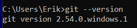
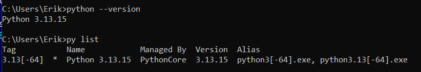
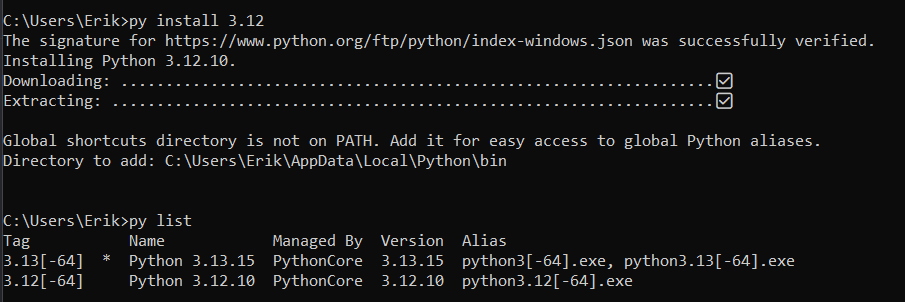

## 3. Сборка окружения
* Редакторы - vs_code, sublime text, pycharm установлены и работают
* git для проверки запустил git --version

* python для проверки запстил python --version, и py list для просмотра установленных версий

* установка python 3.12 через Python install manager (py install 3.12)

