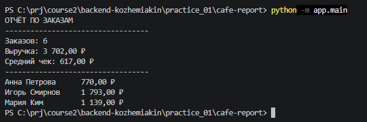
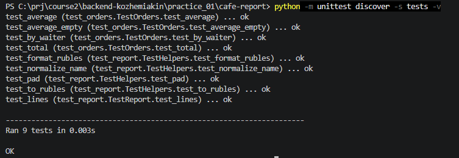

# Практикум по структуре проекта

Состоит из двух практических работ.

## Практическая работа 1. Соберите иерархию проекта

Находится в папке [cafe-report](cafe-report/)

### Что я делал.

1. Восстановил пути и имена .py файлов и файла с данными проверил что все на месте, запустив программу и тесты

`python -m app.main`



`python -m unittest discover -s tests -v`



2. Восстановил пути и имена для .md файлов

3. У меня получилась такая структура (сделал с помощью команды tree)

```
cafe-report
│   .gitignore           какие файлы и папки не идут в git
│   README.md            инструкция как запускать         
│   requirements.txt     загатовка для зависимостей       
│                                                         
├───app                  пакет app                        
│   │   __init__.py      файл нужен для того что бы папка считалась пакетом     
│   │   main.py          главный модуль программы         
│   │                                                     
│   ├───services         пакет сервисов                   
│   │       __init__.py  файл нужен для того что бы папка считалась пакетом  
│   │       orders.py    модуль обработки заказов         
│   │       report.py    модуль формирования отчетов      
│   │                                                     
│   └───utils            пакет утилит                     
│           __init__.py  файл нужен для того что бы папка считалась пакетом         
│           money.py     форматирование рублей            
│           text.py      форматирование текста            
│                                                         
├───data                                                  
│       orders.csv       данные заказов                   
│                                                         
├───docs                                                  
│       about.md         о программе                      
│                                                         
└───tests                                               
        test_orders.py   тест модуля orders.py          
        test_report.py   тест модуля report.py   
```                                              

## Практическая работа 2. Разделите один файл на модули

Находится в папке [text-kit](text-kit/)

### Что я делал

1. Т.к. уже были готовые тесты - из фалов находящихся в папке tests вытащил имена файлов и в каких папках они лежат
структура получившихся папок и файлов в [REAMDE.md](text-kit/README.md#у-меня-получилась-такая-структура-сделал-с-помощью-команды-tree)

2. Проверил что app.main и тесты запускаются, результат в [REAMDE.md](text-kit/README.md#ожидаемый-результат)
    